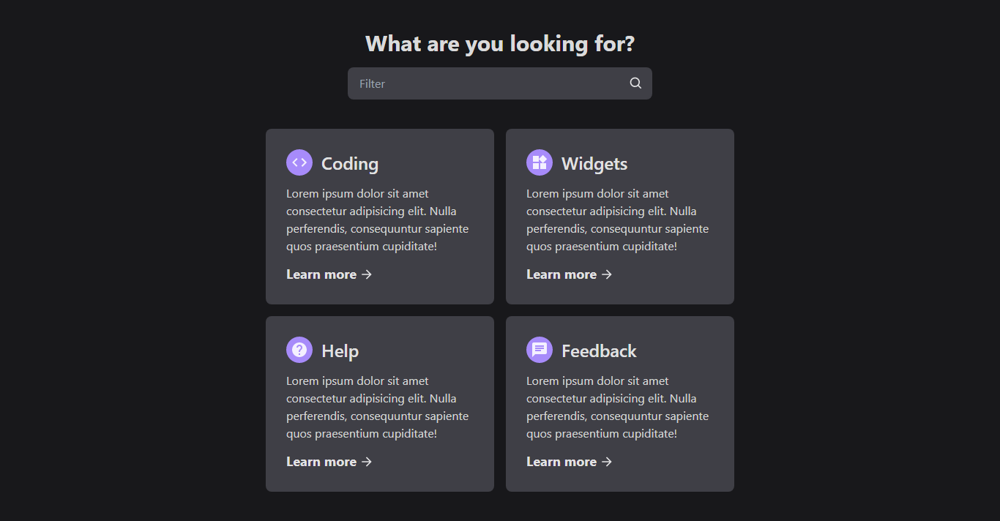

<h1 align="center">Search Filter</h1>

 

  

## 💡 Sobre o projeto

Ideia de um filtro de pesquisa, no qual conforme o usuário for digitando no input, apenas os cards que contêm o conteúdo digitado permanecerão na tela em tempo real.

## 🚀 Tecnologias utilizadas

- ReactJS
- TailwindCSS

### 💻 Preview

[Clique aqui](https://search-filter-edusmpaio.vercel.app/) para acessar o projeto.
